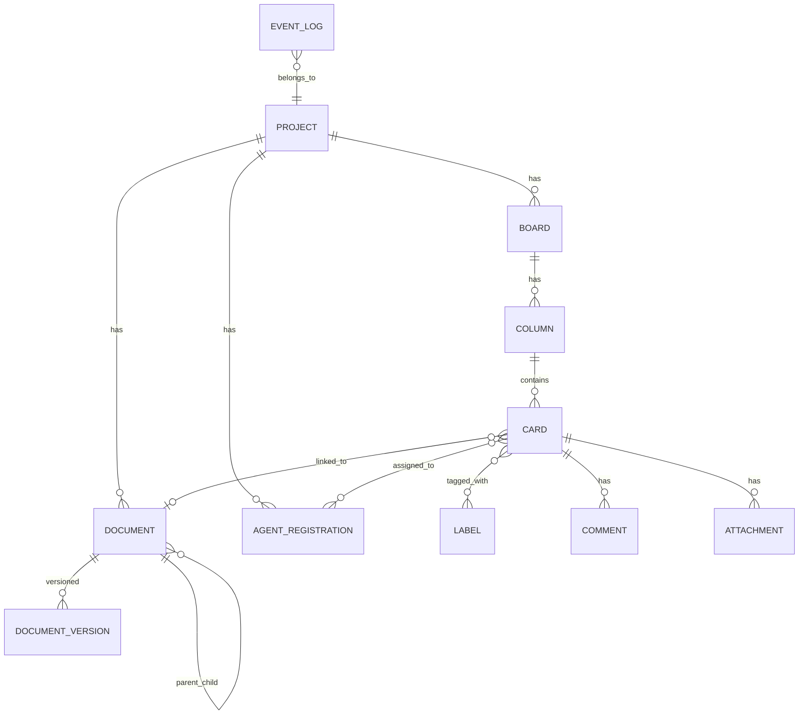
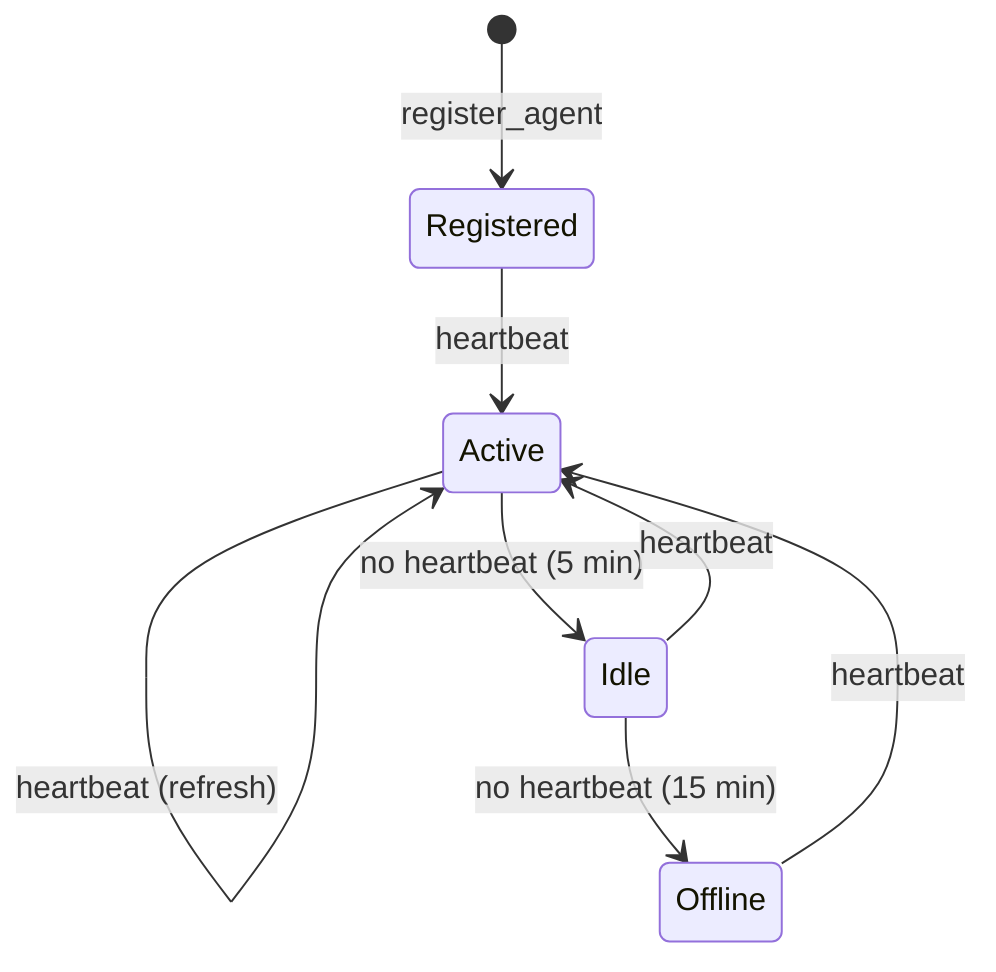

# Muster — System Design

> **Status:** Draft v0.1  
> **Date:** 2026-07-23  
> **Author:** System Architect

> [!IMPORTANT]
> **For implementors**: This document describes the architecture and design decisions. For complete, file-by-file implementation code, see the companion document: [Implementation Specification](file:///Users/erik/Code/Collaborative%20Agent%20Platform/docs/design/implementation-spec.md).

---

## 1. Vision & Goals

**Muster** is a project-management and knowledge hub purpose-built for AI agents — while remaining fully usable by humans. It provides:

| Capability                    | Description                                                                                                               |
| ----------------------------- | ------------------------------------------------------------------------------------------------------------------------- |
| **Kanban Board**              | Track work items through configurable workflow stages (Backlog → In Progress → Done, etc.)                                |
| **Design Documents**          | Author, review, and approve Markdown-based design docs linked to work items                                               |
| **MCP Server**                | Expose every platform capability as MCP tools so any MCP-compatible agent can interact with the platform programmatically |
| **Multi-Agent Collaboration** | Multiple agents (and humans) can work on the same project concurrently with real-time coordination                        |

### Design Principles

1. **Local-First** — Runs as a single process on a local machine. No cloud dependencies, no Docker required. Just `npm start` and go.
2. **Agent-First, Human-Friendly** — Every operation is available via MCP tools _and_ a web UI.
3. **Event-Sourced** — All mutations produce immutable events, providing a full audit trail and enabling real-time sync.
4. **Simple by Default** — Markdown everywhere, minimal config, sensible defaults.
5. **SQL-Native, DB-Agnostic** — All persistence uses standard SQL behind an adapter interface. Starts with SQLite; can swap to PostgreSQL or MySQL without changing service code.
6. **Extensible** — Plugin-friendly architecture; new tools and views can be added without touching the core.

---

## 2. High-Level Architecture

```plain
┌──────────────────────────────────────────────────────────────────┐
│                        Clients                                   │
│                                                                  │
│   ┌──────────┐   ┌──────────┐   ┌──────────┐   ┌──────────┐      │
│   │  Web UI  │   │ Agent A  │   │ Agent B  │   │ Agent N  │      │
│   │ (Browser)│   │(MCP Clt) │   │(MCP Clt) │   │(MCP Clt) │      │
│   └────┬─────┘   └────┬─────┘   └────┬─────┘   └────┬─────┘      │
│        │               │               │               │         │
└────────┼───────────────┼───────────────┼───────────────┼─────────┘
         │               │               │               │
    HTTP/WS         MCP (Streamable HTTP or stdio)
         │               │               │               │
┌────────▼───────────────▼───────────────▼───────────────▼─────-────┐
│                     Muster Server                                 │
│                                                                   │
│  ┌─────────────┐  ┌─────────────┐  ┌──────────────────────────┐   │
│  │   REST API  │  │  MCP Server │  │   Real-Time (SSE / WS)   │   │
│  │  (Express)  │  │  (SDK)      │  │   Event Broadcast        │   │
│  └──────┬──────┘  └──────┬──────┘  └────────────┬─────────────┘   │
│         │                │                       │                │
│         └────────────────┼───────────────────────┘                │
│                          │                                        │
│                  ┌───────▼────────┐                               │
│                  │  Core Services │                               │
│                  │                │                               │
│                  │  • Board Svc   │                               │
│                  │  • Card Svc    │                               │
│                  │  • Doc Svc     │                               │
│                  │  • Event Svc   │                               │
│                  │  • Agent Svc   │                               │
│                  └───────┬────────┘                               │
│                          │                                        │
│                  ┌───────▼────────┐                               │
│                  │   Data Layer   │                               │
│                  │                │                               │
│                  │  ┌──────────────────────────┐                  │
│                  │  │   DatabaseAdapter (iface) │                 │
│                  │  │   ┌────────────────────┐  │                 │
│                  │  │   │ SQLiteAdapter      │  │  ◀── default    │
│                  │  │   │ (better-sqlite3)   │  │                 │
│                  │  │   └────────────────────┘  │                 │
│                  │  │   ┌────────────────────┐  │                 │
│                  │  │   │ PostgresAdapter    │  │  ◀── future     │
│                  │  │   │ (pg)               │  │                 │
│                  │  │   └────────────────────┘  │                 │
│                  │  └──────────────────────────┘                  │
│                  │  • File Store (local FS)                       │
│                  │  • Event Log (append-only table)               │
│                  └────────────────┘                               │
└───────────────────────────────────────────────────────────────────┘
```

### Component Summary

| Component            | Technology                  | Purpose                                                   |
| -------------------- | --------------------------- | --------------------------------------------------------- |
| **REST API**         | Express.js                  | CRUD endpoints for Web UI and external integrations       |
| **MCP Server**       | `@modelcontextprotocol/sdk` | Expose tools, resources, and prompts for AI agents        |
| **Real-Time Layer**  | Server-Sent Events (SSE)    | Broadcast mutations to all connected clients              |
| **Core Services**    | TypeScript modules          | Business logic for boards, cards, documents, agents       |
| **Database Adapter** | `DatabaseAdapter` interface | SQL abstraction — services never import a specific driver |
| **SQLite Adapter**   | `better-sqlite3`            | Default adapter; zero-config, single-file, local-first    |
| **File Store**       | Local filesystem            | Design document content and attachments                   |
| **Event Log**        | Append-only SQL table       | Immutable audit trail of every mutation                   |

---

## 3. SQL Abstraction Layer

All database access goes through a **`DatabaseAdapter`** interface. Services call adapter methods with plain SQL and parameters — they never import `better-sqlite3` or `pg` directly. This makes the database engine a deploy-time choice.

### 3.1 DatabaseAdapter Interface

```typescript
/**
 * Thin SQL adapter — wraps any SQL database engine.
 * Services depend on this interface, never on a specific driver.
 */
export interface DatabaseAdapter {
  /** Run a query that returns rows (SELECT). */
  query<T = Record<string, unknown>>(sql: string, params?: unknown[]): T[];

  /** Run a statement that mutates data (INSERT/UPDATE/DELETE). Returns affected row count. */
  execute(
    sql: string,
    params?: unknown[],
  ): { changes: number; lastInsertRowid?: number | bigint };

  /** Run multiple statements inside a transaction. Rolls back on error. */
  transaction<T>(fn: (adapter: DatabaseAdapter) => T): T;

  /** Run a raw SQL migration string (may contain multiple statements). */
  migrate(sql: string): void;

  /** Close the connection / release resources. */
  close(): void;
}
```

### 3.2 SQLite Adapter (Default)

```typescript
import Database from "better-sqlite3";
import { DatabaseAdapter } from "./adapter.js";

export class SqliteAdapter implements DatabaseAdapter {
  private db: Database.Database;

  constructor(filepath: string) {
    this.db = new Database(filepath);
    this.db.pragma("journal_mode = WAL"); // Better concurrent read performance
    this.db.pragma("foreign_keys = ON"); // Enforce FK constraints
  }

  query<T>(sql: string, params: unknown[] = []): T[] {
    return this.db.prepare(sql).all(...params) as T[];
  }

  execute(sql: string, params: unknown[] = []) {
    const info = this.db.prepare(sql).run(...params);
    return { changes: info.changes, lastInsertRowid: info.lastInsertRowid };
  }

  transaction<T>(fn: (adapter: DatabaseAdapter) => T): T {
    return this.db.transaction(() => fn(this))() as T;
  }

  migrate(sql: string) {
    this.db.exec(sql);
  }

  close() {
    this.db.close();
  }
}
```

### 3.3 SQL Dialect Guidelines

To keep migrations and queries portable across SQLite and future backends:

| Rule                 | SQLite                            | PostgreSQL equivalent                             |
| -------------------- | --------------------------------- | ------------------------------------------------- |
| Primary keys         | `TEXT NOT NULL PRIMARY KEY`       | `TEXT PRIMARY KEY`                                |
| Timestamps           | `TEXT` (ISO 8601 strings)         | `TIMESTAMPTZ` (can adapt in the Postgres adapter) |
| Booleans             | `INTEGER` (0/1)                   | `BOOLEAN`                                         |
| JSON columns         | `TEXT` (parse in app)             | `JSONB` (can adapt in the Postgres adapter)       |
| Auto-increment       | Not used — ULIDs generated in app | Same                                              |
| String concatenation | `\|\|`                            | `\|\|`                                            |

> [!TIP]
> The adapter pattern means you can also run the full test suite against an **in-memory SQLite** database (`:memory:`) for fast, isolated tests.

---

## 4. Data Model

### 4.1 Entity-Relationship Diagram



### 4.2 Core Tables

#### `project`

| Column        | Type            | Description           |
| ------------- | --------------- | --------------------- |
| `id`          | TEXT (ULID)     | Primary key           |
| `name`        | TEXT            | Project name          |
| `description` | TEXT            | Optional description  |
| `created_at`  | TEXT (ISO 8601) | Creation timestamp    |
| `updated_at`  | TEXT (ISO 8601) | Last update timestamp |

#### `board`

| Column       | Type            | Description                                  |
| ------------ | --------------- | -------------------------------------------- |
| `id`         | TEXT (ULID)     | Primary key                                  |
| `project_id` | TEXT            | FK → project                                 |
| `name`       | TEXT            | Board name (e.g. "Sprint 1", "Feature Work") |
| `created_at` | TEXT (ISO 8601) |                                              |
| `updated_at` | TEXT (ISO 8601) |                                              |

#### `column`

| Column      | Type        | Description                                        |
| ----------- | ----------- | -------------------------------------------------- |
| `id`        | TEXT (ULID) | Primary key                                        |
| `board_id`  | TEXT        | FK → board                                         |
| `name`      | TEXT        | Column name (e.g. "Backlog", "In Progress")        |
| `position`  | TEXT        | LexoRank string for ordering                       |
| `wip_limit` | INTEGER     | Optional work-in-progress limit (NULL = unlimited) |

#### `card`

| Column        | Type            | Description                                |
| ------------- | --------------- | ------------------------------------------ |
| `id`          | TEXT (ULID)     | Primary key                                |
| `column_id`   | TEXT            | FK → column                                |
| `title`       | TEXT            | Card title                                 |
| `description` | TEXT            | Markdown body                              |
| `position`    | TEXT            | LexoRank string for ordering within column |
| `priority`    | TEXT            | `critical` \| `high` \| `medium` \| `low`  |
| `due_date`    | TEXT (ISO 8601) | Optional deadline                          |
| `created_at`  | TEXT (ISO 8601) |                                            |
| `updated_at`  | TEXT (ISO 8601) |                                            |
| `archived`    | INTEGER         | 0 = active, 1 = archived                   |

#### `label`

| Column     | Type        | Description    |
| ---------- | ----------- | -------------- |
| `id`       | TEXT (ULID) | Primary key    |
| `board_id` | TEXT        | FK → board     |
| `name`     | TEXT        | Label name     |
| `color`    | TEXT        | Hex color code |

#### `card_label` (junction)

| Column     | Type            |
| ---------- | --------------- |
| `card_id`  | TEXT FK → card  |
| `label_id` | TEXT FK → label |

#### `card_assignee` (junction)

| Column     | Type                         |
| ---------- | ---------------------------- |
| `card_id`  | TEXT FK → card               |
| `agent_id` | TEXT FK → agent_registration |

#### `comment`

| Column       | Type            | Description             |
| ------------ | --------------- | ----------------------- |
| `id`         | TEXT (ULID)     | Primary key             |
| `card_id`    | TEXT            | FK → card               |
| `author_id`  | TEXT            | FK → agent_registration |
| `content`    | TEXT            | Markdown comment body   |
| `created_at` | TEXT (ISO 8601) |                         |

#### `attachment`

| Column       | Type            | Description       |
| ------------ | --------------- | ----------------- |
| `id`         | TEXT (ULID)     | Primary key       |
| `card_id`    | TEXT            | FK → card         |
| `filename`   | TEXT            | Original filename |
| `path`       | TEXT            | Storage path      |
| `mime_type`  | TEXT            | MIME type         |
| `size_bytes` | INTEGER         | File size         |
| `created_at` | TEXT (ISO 8601) |                   |

---

### 4.3 Design Documents

#### `document`

| Column       | Type            | Description                                        |
| ------------ | --------------- | -------------------------------------------------- |
| `id`         | TEXT (ULID)     | Primary key                                        |
| `project_id` | TEXT            | FK → project                                       |
| `parent_id`  | TEXT            | FK → document (nullable, enables tree hierarchy)   |
| `title`      | TEXT            | Document title                                     |
| `content`    | TEXT            | Markdown body (current version)                    |
| `status`     | TEXT            | `draft` \| `in_review` \| `approved` \| `archived` |
| `author_id`  | TEXT            | FK → agent_registration                            |
| `version`    | INTEGER         | Current version number                             |
| `created_at` | TEXT (ISO 8601) |                                                    |
| `updated_at` | TEXT (ISO 8601) |                                                    |

#### `document_version`

| Column           | Type            | Description                         |
| ---------------- | --------------- | ----------------------------------- |
| `id`             | TEXT (ULID)     | Primary key                         |
| `document_id`    | TEXT            | FK → document                       |
| `version`        | INTEGER         | Version number                      |
| `content`        | TEXT            | Snapshot of content at this version |
| `author_id`      | TEXT            | Who made this version               |
| `change_summary` | TEXT            | Description of changes              |
| `created_at`     | TEXT (ISO 8601) |                                     |

---

### 4.4 Agent Registration

#### `agent_registration`

| Column         | Type            | Description                                             |
| -------------- | --------------- | ------------------------------------------------------- |
| `id`           | TEXT (ULID)     | Primary key                                             |
| `project_id`   | TEXT            | FK → project                                            |
| `name`         | TEXT            | Display name (e.g. "Claude-Backend", "Gemini-Frontend") |
| `type`         | TEXT            | `ai_agent` \| `human`                                   |
| `role`         | TEXT            | `owner` \| `contributor` \| `observer`                  |
| `capabilities` | TEXT            | JSON array of capability tags                           |
| `status`       | TEXT            | `active` \| `idle` \| `offline`                         |
| `last_seen_at` | TEXT (ISO 8601) | Last heartbeat                                          |
| `created_at`   | TEXT (ISO 8601) |                                                         |

---

### 4.5 Event Log

#### `event`

| Column        | Type            | Description                                                                 |
| ------------- | --------------- | --------------------------------------------------------------------------- |
| `id`          | TEXT (ULID)     | Primary key                                                                 |
| `project_id`  | TEXT            | FK → project                                                                |
| `entity_type` | TEXT            | `card` \| `column` \| `board` \| `document` \| `agent`                      |
| `entity_id`   | TEXT            | ID of the affected entity                                                   |
| `action`      | TEXT            | `created` \| `updated` \| `moved` \| `deleted` \| `assigned` \| `commented` |
| `actor_id`    | TEXT            | FK → agent_registration                                                     |
| `payload`     | TEXT            | JSON diff / details                                                         |
| `created_at`  | TEXT (ISO 8601) |                                                                             |

---

## 5. MCP Server Design

The MCP server is the **primary interface for AI agents**. It exposes tools, resources, and prompts that map 1:1 to core platform capabilities.

### 5.1 Transport

| Mode                | Use Case                                                                       |
| ------------------- | ------------------------------------------------------------------------------ |
| **Stdio**           | Agent running locally alongside the platform (e.g. CLI agent, IDE integration) |
| **Streamable HTTP** | Remote agents, multiple concurrent agents, web-based agents                    |

Both transports are supported simultaneously. The Streamable HTTP endpoint lives at `POST /mcp` on the same Express server.

### 5.2 MCP Tools

Tools are grouped by domain. Every tool returns structured JSON results.

#### Board Management

| Tool           | Parameters           | Description                                |
| -------------- | -------------------- | ------------------------------------------ |
| `list_boards`  | `project_id`         | List all boards in a project               |
| `create_board` | `project_id`, `name` | Create a new board with default columns    |
| `get_board`    | `board_id`           | Get board with all columns and card counts |

#### Column Management

| Tool            | Parameters                                    | Description                     |
| --------------- | --------------------------------------------- | ------------------------------- |
| `create_column` | `board_id`, `name`, `position?`, `wip_limit?` | Add a column to a board         |
| `update_column` | `column_id`, `name?`, `wip_limit?`            | Update column properties        |
| `move_column`   | `column_id`, `position`                       | Reorder a column                |
| `delete_column` | `column_id`                                   | Remove a column (must be empty) |

#### Card Management

| Tool            | Parameters                                                                 | Description                              |
| --------------- | -------------------------------------------------------------------------- | ---------------------------------------- |
| `list_cards`    | `column_id?`, `board_id?`, `assignee_id?`, `label?`, `status?`             | List/filter cards                        |
| `create_card`   | `column_id`, `title`, `description?`, `priority?`, `labels?`, `assignees?` | Create a card                            |
| `get_card`      | `card_id` (ULID or key e.g. `MUS-49`)                                  | Get full card details including comments |
| `update_card`   | `card_id`, `title?`, `description?`, `priority?`, `due_date?`              | Update card fields                       |
| `move_card`     | `card_id`, `target_column_id`, `position?`                                 | Move a card to a different column        |
| `assign_card`   | `card_id`, `agent_id`                                                      | Assign an agent to a card                |
| `unassign_card` | `card_id`, `agent_id`                                                      | Remove an agent from a card              |
| `add_comment`   | `card_id`, `content`                                                       | Add a comment to a card                  |
| `add_label`     | `card_id`, `label_id`                                                      | Tag a card with a label                  |
| `archive_card`  | `card_id`                                                                  | Archive a completed card                 |

#### Document Management

| Tool                   | Parameters                                            | Description                                              |
| ---------------------- | ----------------------------------------------------- | -------------------------------------------------------- |
| `list_documents`       | `project_id`, `status?`, `parent_id?`                 | List/filter documents                                    |
| `create_document`      | `project_id`, `title`, `content`, `parent_id?`        | Create a design doc                                      |
| `get_document`         | `document_id`, `version?`                             | Read a document (optionally a specific version)          |
| `update_document`      | `document_id`, `title?`, `content?`, `change_summary` | Update a document (creates a new version)                |
| `set_document_status`  | `document_id`, `status`                               | Move doc through workflow (draft → in_review → approved) |
| `get_document_history` | `document_id`                                         | List all versions of a document                          |

#### Agent & Project Management

| Tool                  | Parameters                                            | Description                                                      |
| --------------------- | ----------------------------------------------------- | ---------------------------------------------------------------- |
| `register_agent`      | `project_id`, `name`, `type`, `role`, `capabilities?` | Register a new agent                                             |
| `heartbeat`           | `agent_id`                                            | Update last-seen timestamp and status                            |
| `list_agents`         | `project_id`                                          | List all registered agents and their status                      |
| `get_project_summary` | `project_id`                                          | High-level project overview (boards, card counts, active agents) |

#### Event & Activity

| Tool               | Parameters                                                     | Description                                |
| ------------------ | -------------------------------------------------------------- | ------------------------------------------ |
| `get_activity`     | `project_id`, `entity_type?`, `entity_id?`, `since?`, `limit?` | Query the event log                        |
| `subscribe_events` | `project_id`, `entity_type?`, `entity_id?`                     | Subscribe to real-time events (SSE stream) |

### 5.3 MCP Resources

Resources expose read-only data that agents can pull into their context.

| Resource URI                     | Description                             |
| -------------------------------- | --------------------------------------- |
| `muster://project/{id}/summary`  | Project overview as structured Markdown |
| `muster://board/{id}`            | Full board state (columns + cards)      |
| `muster://card/{id}`             | Card detail with comments and history   |
| `muster://document/{id}`         | Document content (latest version)       |
| `muster://project/{id}/activity` | Recent activity feed                    |

### 5.4 MCP Prompts

Reusable prompt templates for common agent workflows.

| Prompt            | Arguments                | Description                                     |
| ----------------- | ------------------------ | ----------------------------------------------- |
| `summarize_board` | `board_id`               | Generate a summary of the board's current state |
| `plan_sprint`     | `board_id`, `capacity`   | Suggest card prioritization for a sprint        |
| `review_document` | `document_id`            | Review a design doc and provide feedback        |
| `standup_report`  | `project_id`, `agent_id` | Generate a standup-style status update          |

---

## 6. REST API Design

The REST API mirrors the MCP tools and serves the Web UI.

### Base URL: `/api/v1`

```
# Projects
GET    /projects
POST   /projects
GET    /projects/:id
PUT    /projects/:id
DELETE /projects/:id
GET    /projects/:id/summary

# Boards
GET    /projects/:projectId/boards
POST   /projects/:projectId/boards
GET    /boards/:id
PUT    /boards/:id
DELETE /boards/:id

# Columns
POST   /boards/:boardId/columns
PUT    /columns/:id
DELETE /columns/:id
PATCH  /columns/:id/position

# Cards
GET    /boards/:boardId/cards           (with query filters)
POST   /columns/:columnId/cards
GET    /cards/:id
PUT    /cards/:id
DELETE /cards/:id
PATCH  /cards/:id/move                  { target_column_id, position }
POST   /cards/:id/comments
POST   /cards/:id/labels
DELETE /cards/:id/labels/:labelId
POST   /cards/:id/assignees
DELETE /cards/:id/assignees/:agentId

# Documents
GET    /projects/:projectId/documents
POST   /projects/:projectId/documents
GET    /documents/:id
PUT    /documents/:id
GET    /documents/:id/versions
GET    /documents/:id/versions/:version
PATCH  /documents/:id/status

# Agents
GET    /projects/:projectId/agents
POST   /projects/:projectId/agents
PUT    /agents/:id
POST   /agents/:id/heartbeat

# Events
GET    /projects/:projectId/events      (with query filters)
GET    /projects/:projectId/events/stream   (SSE)
```

---

## 7. Real-Time Event System

### Architecture

All mutations in the system flow through the **Event Service**, which:

1. **Persists** the event to the `event` table
2. **Broadcasts** the event to all connected SSE/WebSocket clients
3. **Triggers** any registered webhooks or agent notifications

```
Mutation Request
       │
       ▼
┌──────────────┐     ┌──────────────┐     ┌──────────────┐
│  Core Service│────▶│ Event Service │────▶│   Event Log  │
│  (Board/Card)│     │              │     │  (SQLite)    │
└──────────────┘     └──────┬───────┘     └──────────────┘
                            │
                  ┌─────────┼─────────┐
                  ▼         ▼         ▼
             ┌────────┐ ┌────────┐ ┌────────┐
             │SSE Clt │ │SSE Clt │ │Webhook │
             │(Web UI)│ │(Agent) │ │        │
             └────────┘ └────────┘ └────────┘
```

### Event Payload Format

```json
{
  "id": "01J6XY...",
  "project_id": "01J6XA...",
  "entity_type": "card",
  "entity_id": "01J6XZ...",
  "action": "moved",
  "actor_id": "01J6XB...",
  "payload": {
    "from_column_id": "01J6XC...",
    "to_column_id": "01J6XD...",
    "position": "aaa|bbb"
  },
  "created_at": "2026-07-23T18:31:00Z"
}
```

---

## 8. Multi-Agent Coordination

### 8.1 Agent Lifecycle



### 8.2 Task Claiming

To prevent two agents from working on the same card:

1. Agent calls `assign_card(card_id, self_agent_id)`
2. If the card is already assigned, the tool returns a conflict with the current assignee(s)
3. Agent can check `list_cards(assignee_id=null)` to find unclaimed work
4. When done, agent calls `move_card` to advance the card and optionally `unassign_card`

### 8.3 Communication Patterns

| Pattern          | Mechanism                | Example                                                   |
| ---------------- | ------------------------ | --------------------------------------------------------- |
| **Broadcast**    | Events via SSE           | "Card X was moved to Done" — all agents see it            |
| **Direct**       | Comments on cards        | Agent A leaves a review comment for Agent B               |
| **Coordination** | Board structure          | Agents observe WIP limits and column states               |
| **Status**       | Heartbeat + activity log | Agents can check who's online and what they're working on |

---

## 9. Technology Stack

| Layer              | Technology                  | Rationale                                                                    |
| ------------------ | --------------------------- | ---------------------------------------------------------------------------- |
| **Runtime**        | Node.js 20+                 | Async I/O, excellent MCP SDK support                                         |
| **Language**       | TypeScript                  | Type safety across the full stack                                            |
| **HTTP Framework** | Express.js                  | Mature, simple, wide ecosystem                                               |
| **MCP SDK**        | `@modelcontextprotocol/sdk` | Official SDK with stdio + Streamable HTTP                                    |
| **SQL Adapter**    | `DatabaseAdapter` interface | Services depend on the interface, not a driver                               |
| **Default DB**     | SQLite via `better-sqlite3` | Zero-config, single-file, WAL mode for concurrent reads                      |
| **ID Generation**  | ULID (`ulid` package)       | Sortable, unique, URL-safe                                                   |
| **Ordering**       | LexoRank algorithm          | Fractional indexing for drag-and-drop without reindexing                     |
| **Validation**     | Zod                         | Runtime validation, MCP tool schema generation                               |
| **Web UI**         | Vanilla HTML/CSS/JS         | Lightweight, no build step for the UI                                        |
| **Real-Time**      | Server-Sent Events          | Unidirectional push, simpler than WebSockets, sufficient for event broadcast |

### Local Runtime Model

Muster runs as a **single Node.js process** on the developer's machine:

```
$ npm start

  ✓ SQLite database opened at ./data/muster.db
  ✓ Migrations applied (schema v3)
  ✓ MCP stdio transport ready
  ✓ MCP Streamable HTTP at POST /mcp
  ✓ REST API at http://localhost:6878/api/v1
  ✓ Web UI at http://localhost:6878
  ✓ SSE event stream at http://localhost:6878/api/v1/events/stream
```

No external services required. The entire state lives in a single `muster.db` SQLite file plus an `attachments/` directory — both easily backed up, copied, or version-controlled.

---

## 10. Project Structure

```
muster/
├── package.json
├── tsconfig.json
├── README.md
│
├── src/
│   ├── index.ts                    # Entry point — starts Express + MCP
│   │
│   ├── config/
│   │   └── index.ts                # Configuration (ports, DB path, etc.)
│   │
│   ├── db/
│   │   ├── adapter.ts              # DatabaseAdapter interface
│   │   ├── sqlite-adapter.ts       # SQLite implementation (default)
│   │   ├── factory.ts              # Creates adapter from config (SQLite / Postgres / ...)
│   │   ├── migrations/             # Portable SQL migration files
│   │   └── seed.ts                 # Optional seed data
│   │
│   ├── services/
│   │   ├── project.service.ts
│   │   ├── board.service.ts
│   │   ├── column.service.ts
│   │   ├── card.service.ts
│   │   ├── document.service.ts
│   │   ├── agent.service.ts
│   │   └── event.service.ts
│   │
│   ├── mcp/
│   │   ├── server.ts               # MCP server setup & tool registration
│   │   ├── tools/
│   │   │   ├── board.tools.ts
│   │   │   ├── card.tools.ts
│   │   │   ├── document.tools.ts
│   │   │   └── agent.tools.ts
│   │   ├── resources/
│   │   │   └── index.ts            # MCP resource definitions
│   │   └── prompts/
│   │       └── index.ts            # MCP prompt templates
│   │
│   ├── api/
│   │   ├── router.ts               # Express router setup
│   │   ├── middleware/
│   │   │   ├── error-handler.ts
│   │   │   └── validate.ts
│   │   └── routes/
│   │       ├── project.routes.ts
│   │       ├── board.routes.ts
│   │       ├── card.routes.ts
│   │       ├── document.routes.ts
│   │       ├── agent.routes.ts
│   │       └── event.routes.ts
│   │
│   ├── realtime/
│   │   └── sse.ts                  # SSE connection manager & broadcast
│   │
│   └── shared/
│       ├── types.ts                # Shared TypeScript types
│       ├── errors.ts               # Custom error classes
│       └── lexorank.ts             # LexoRank implementation
│
├── public/                         # Static Web UI files
│   ├── index.html                  # Dashboard / overview page
│   ├── board.html                  # Kanban board view
│   ├── document.html               # Document viewer / editor
│   ├── activity.html               # Activity feed page
│   ├── styles.css                  # Global styles
│   └── js/
│       ├── app.js                  # Shared: API client, SSE, routing
│       ├── dashboard.js            # Dashboard page logic
│       ├── board.js                # Board page logic (drag-and-drop)
│       ├── document.js             # Document page logic
│       └── activity.js             # Activity feed logic
│
├── data/                           # SQLite DB and file storage (gitignored)
│   ├── muster.db
│   └── attachments/
│
└── tests/
    ├── services/
    ├── mcp/
    └── api/
```

---

## 11. Web UI — Human Overview

The Web UI is a lightweight, vanilla HTML/CSS/JS interface served by Express from the `public/` directory. It gives you (the human operator) a real-time window into what's happening across your project. It connects to the SSE event stream so everything updates live — no refresh needed.

### 11.1 Pages

| Page          | URL                         | Purpose                                    |
| ------------- | --------------------------- | ------------------------------------------ |
| **Dashboard** | `/`                         | At-a-glance overview of the entire project |
| **Board**     | `/board.html?id={boardId}`  | Full Kanban board with columns and cards   |
| **Document**  | `/document.html?id={docId}` | Read/edit a design document                |
| **Activity**  | `/activity.html`            | Scrollable, filterable activity feed       |

### 11.2 Dashboard (Home Page)

The dashboard is the landing page. It answers the question: **"What is going on right now?"**

```
┌─────────────────────────────────────────────────────────────────────┐
│  Muster              [Project: My App v2]   │
├─────────────────────────────────────────────────────────────────────┤
│                                                                     │
│  ┌─── Agents Online ──────────────────────────────────────────────┐ │
│  │ 🟢 Claude-Backend    contributor   working on: AUTH-042        │ │
│  │ 🟢 Gemini-Frontend   contributor   working on: UI-018         │ │
│  │ 🟡 CodeReviewer      contributor   idle (last seen 3m ago)    │ │
│  │ 🔴 Tester            observer      offline                    │ │
│  └────────────────────────────────────────────────────────────────┘ │
│                                                                     │
│  ┌─── Board Snapshot: Sprint 1 ───────────────────────────────────┐ │
│  │  Backlog (7)  │ To Do (3) │ In Progress (2) │ Review (1) │ Done (12)  │
│  │  ████████████ │ ██████    │ █████  ⚠ WIP:3  │ ███        │ ██████████ │
│  └────────────────────────────────────────────────────────────────┘ │
│                                                                     │
│  ┌─── Recent Activity ────────────────────────────────────────────┐ │
│  │ 2m ago   Claude-Backend    moved AUTH-042 → In Progress        │ │
│  │ 5m ago   Gemini-Frontend   commented on UI-018: "CSS done"     │ │
│  │ 8m ago   Claude-Backend    created card AUTH-043                │ │
│  │ 12m ago  Gemini-Frontend   moved UI-017 → Done                 │ │
│  │ 15m ago  CodeReviewer      approved doc "Auth Flow Design"      │ │
│  │                                                  [View all →]  │ │
│  └────────────────────────────────────────────────────────────────┘ │
│                                                                     │
│  ┌─── Design Documents ──────────────────────────────────────────┐ │
│  │ 📝 Auth Flow Design              approved     v3   Jul 23     │ │
│  │ 📝 Database Schema                in_review    v2   Jul 23     │ │
│  │ 📝 API Rate Limiting Strategy     draft        v1   Jul 22     │ │
│  │                                                  [View all →]  │ │
│  └────────────────────────────────────────────────────────────────┘ │
│                                                                     │
└─────────────────────────────────────────────────────────────────────┘
```

#### Dashboard Panels

| Panel                | Data Source                                | Updates via                                     |
| -------------------- | ------------------------------------------ | ----------------------------------------------- |
| **Agents Online**    | `GET /api/v1/projects/:id/agents`          | SSE `agent` events (heartbeat, status change)   |
| **Board Snapshot**   | `GET /api/v1/boards/:id`                   | SSE `card` events (moved, created, archived)    |
| **Recent Activity**  | `GET /api/v1/projects/:id/events?limit=20` | SSE all events (appended in real-time)          |
| **Design Documents** | `GET /api/v1/projects/:id/documents`       | SSE `document` events (created, status changed) |

### 11.3 Board View

A standard Kanban board with drag-and-drop columns and cards.

- **Columns** displayed left to right in LexoRank order
- **Cards** within each column, showing title, priority badge, assignee avatar, and label dots
- **WIP limit indicators** — column header turns amber when at limit, red when exceeded
- **Card detail modal** — click a card to see full description, comments, labels, and history
- Drag-and-drop uses the HTML Drag and Drop API, calling `PATCH /api/v1/cards/:id/move` on drop

### 11.4 Document Browser

- **Tree navigation** on the left (parent/child document hierarchy)
- **Markdown rendered view** on the right with a toggle to **edit mode** (raw Markdown textarea)
- **Version history** sidebar showing diffs between versions
- **Status badge** (draft / in_review / approved) with buttons to advance the status

### 11.5 Activity Feed

- Chronological list of all events across the project
- **Filters**: by entity type (card, document, agent), by actor, by time range
- **Live tail**: new events appear at the top via SSE, with a subtle slide-in animation
- Each event links to the relevant card, document, or agent

### 11.6 Real-Time Updates

All pages connect to the SSE stream on load:

```javascript
const events = new EventSource("/api/v1/projects/${projectId}/events/stream");

events.onmessage = (e) => {
  const event = JSON.parse(e.data);
  // Route to the appropriate UI update handler
  switch (event.entity_type) {
    case "card":
      updateBoardUI(event);
      break;
    case "agent":
      updateAgentPanel(event);
      break;
    case "document":
      updateDocList(event);
      break;
  }
};
```

---

## 12. Default Board Template

When a new board is created, it gets these default columns:

| Position | Column          | WIP Limit | Purpose                                  |
| -------- | --------------- | --------- | ---------------------------------------- |
| 1        | **Backlog**     | —         | Unstarted work, ideas, future tasks      |
| 2        | **To Do**       | —         | Planned for the current cycle            |
| 3        | **In Progress** | 3         | Actively being worked on                 |
| 4        | **In Review**   | 2         | Awaiting review from another agent/human |
| 5        | **Done**        | —         | Completed work                           |

---

## 13. Example Workflows

### 13.1 Agent Joins and Picks Up Work

```
Agent                              Muster Server
  │                                    │
  ├── register_agent ─────────────────▶│  → Creates agent record
  │◀─────────────────── agent_id ──────┤
  │                                    │
  ├── list_boards ────────────────────▶│
  │◀─────────────────── boards[] ──────┤
  │                                    │
  ├── list_cards(assignee=null) ──────▶│  → Finds unclaimed cards
  │◀─────────────────── cards[] ───────┤
  │                                    │
  ├── get_card(card_id) ──────────────▶│  → Reads full description
  │◀─────────────────── card ──────────┤
  │                                    │
  ├── assign_card(card_id, self) ─────▶│  → Claims the card
  │◀─────────────────── ok ────────────┤
  │                                    │
  ├── move_card(card_id, "In Progress")▶│
  │◀─────────────────── ok ────────────┤
  │                                    │
  │  ... agent does the work ...       │
  │                                    │
  ├── add_comment(card_id, "Done...") ▶│
  ├── move_card(card_id, "In Review") ▶│
  │                                    │
```

### 13.2 Design Doc Review Cycle

```
Author Agent                       Muster Server                    Reviewer Agent
  │                                    │                              │
  ├── create_document ────────────────▶│  (status: draft)             │
  │                                    │                              │
  ├── update_document ────────────────▶│  (iterates on content)       │
  │                                    │                              │
  ├── set_document_status("in_review")▶│                              │
  │                                    ├── SSE event ────────────────▶│
  │                                    │                              │
  │                                    │◀── get_document ─────────────┤
  │                                    │                              │
  │                                    │◀── add_comment (on linked    │
  │                                    │     card, with feedback) ────┤
  │                                    │                              │
  │◀── SSE event (comment) ───────────┤                              │
  │                                    │                              │
  ├── update_document (address feedback)▶│                            │
  │                                    │                              │
  │                                    │◀── set_document_status ──────┤
  │                                    │     ("approved")             │
```

---

## 14. Security Considerations

| Concern              | Approach                                                                                               |
| -------------------- | ------------------------------------------------------------------------------------------------------ |
| **Authentication**   | API key per agent (passed as Bearer token or MCP auth header). Humans authenticate via session cookie. |
| **Authorization**    | Role-based: `owner` (full access), `contributor` (CRUD on cards/docs), `observer` (read-only)          |
| **Rate Limiting**    | Per-agent rate limits to prevent runaway agents from flooding the system                               |
| **Input Validation** | Zod schemas validate all inputs at the API and MCP layer                                               |
| **Data Isolation**   | Each project is a separate namespace; agents cannot access other projects unless registered            |

---

## 15. Future Considerations

These are **not in scope for v1** but inform architectural decisions:

- **PostgreSQL adapter** — Implement `PostgresAdapter` using the `pg` package. The `DatabaseAdapter` interface is already designed for this; only the adapter + a few dialect-specific queries need to change. Target this when concurrent write throughput or multi-machine deployment is needed.
- **MySQL adapter** — Same pattern as PostgreSQL, using `mysql2`.
- **Agent-to-Agent messaging** — Direct message channel between agents (beyond card comments)
- **Automated workflows** — Trigger actions when cards enter specific columns (e.g. auto-assign reviewer)
- **Multiple views** — Table view, timeline/Gantt view, calendar view for cards
- **File preview** — Render attachments (images, PDFs) in the Web UI
- **Plugin system** — Allow custom tools and event handlers to be registered dynamically
- **OAuth 2.1** — Per-spec MCP authentication for remote agents
- **Remote deployment** — Run Muster as a persistent server (Docker, systemd) with Streamable HTTP MCP transport for remote agents

---

## Appendix A: Glossary

| Term          | Definition                                                                                      |
| ------------- | ----------------------------------------------------------------------------------------------- |
| **Muster**    | Muster                                                                                          |
| **MCP**       | Model Context Protocol — the standard for AI ↔ tool communication                               |
| **ULID**      | Universally Unique Lexicographically Sortable Identifier                                        |
| **LexoRank**  | A fractional indexing scheme that enables inserting items between two others without reindexing |
| **SSE**       | Server-Sent Events — a one-way push protocol from server to client over HTTP                    |
| **WIP Limit** | Work In Progress limit — max cards allowed in a Kanban column simultaneously                    |

---

## Appendix B: Key Dependencies

```json
{
  "dependencies": {
    "@modelcontextprotocol/sdk": "^1.x",
    "better-sqlite3": "^11.x",
    "express": "^4.x",
    "ulid": "^2.x",
    "zod": "^3.x"
  },
  "devDependencies": {
    "typescript": "^5.x",
    "@types/express": "^4.x",
    "@types/better-sqlite3": "^7.x",
    "vitest": "^3.x"
  }
}
```
